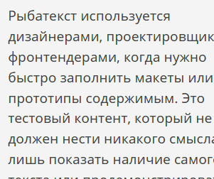

# ⚡ Quick Actions Toolbar for Tampermonkey

[English](#-english) | [Русский](#-русский)

---

## 🎬 Demo / Демонстрация

| 📝 Text Selection Toolbar | 🖼️ Image Quick Toolbar |
| :---: | :---: |
|  |  |

---

## 🇬🇧 English

Ultra-compact and elegant floating action toolbars for **selected text** and **web images**. Compatible with all major browsers (**Google Chrome, Microsoft Edge, Mozilla Firefox, Brave, Opera**) via the **Tampermonkey** extension.

The repository includes two standalone lightweight userscripts:
1. [`quick-selection-toolbar.user.js`](quick-selection-toolbar.user.js) — mini floating toolbar for **selected text** (Copy, Google Search, Dismiss).
2. [`quick-image-toolbar.user.js`](quick-image-toolbar.user.js) — sleek toolbar for **images of all formats** (Copy image to clipboard, Search with Google Lens, Dismiss).

---

### 📥 Installation via Tampermonkey

1. **Install Tampermonkey**: if not already installed, get it from [tampermonkey.net](https://www.tampermonkey.net/) or your browser's web store.
2. Click the **Tampermonkey icon** in your browser toolbar and choose **"Create a new script"** (`+`).
3. Delete any default template code in the editor.
4. Copy and paste the script code:
   - For text: [`quick-selection-toolbar.user.js`](quick-selection-toolbar.user.js)
   - For images: [`quick-image-toolbar.user.js`](quick-image-toolbar.user.js)
5. Save via **File ➔ Save** (`Ctrl + S`).

> ℹ️ **First-time permission note for Tampermonkey v5.0+**:  
> When copying an image for the very first time, Tampermonkey v5+ may display a one-time security prompt (*"A user script wants to access a cross-origin resource"*).  
> **What to do**: Click **"⚠️ Always allow all domains"** (or **"Don't ask again"**). This is a built-in security feature introduced in Tampermonkey v5+. Once granted, the extension permanently saves this rule and will never prompt you again — all images will copy silently in 1 click.

---

### ✨ Features & Implementation

#### 1. Text Selection Toolbar (`quick-selection-toolbar.user.js`)
- **True cursor tracking (bidirectional)**: centered right at the cursor release point, even when selecting text backwards (right-to-left or bottom-to-top).
- **Smart multi-line placement with styled text support**:
  - Uses vertical overlap analysis (`groupRectsIntoLines`) so inline styles, links, and code tags on a single line are never falsely classified as multi-line.
  - **Single line**: always appears above the line.
  - **Multi-line**: automatically detects selection direction and appears outside the selection (below when dragging down, above when dragging up) so it never obscures the selected text.
- **Instant appearance (70 ms delay)**: debounce prevents flickering during rapid double/triple clicks (selecting a word or paragraph).
- **Zero bloat, snappy feel**: instant appearance with no sluggish animations.
- **Copy confirmation**: icon transforms into a green checkmark for 150 ms, then immediately dismisses.
- **Dismiss button (×)**: closes the toolbar without deselecting the text.
- **Shadow DOM isolation**: styles never conflict with or leak into host websites with `z-index: 2147483647 !important`.

#### 2. Image Action Toolbar (`quick-image-toolbar.user.js`)
- Appears in the **bottom-left corner** inside the image on hover.
- **Deep overlay penetration**: uses `elementsFromPoint` and coordinate tracking to detect images even when covered by transparent hover layers, dark scrims, or interactive web app overlays.
- **Universal image format support**:
  - **JPG / JPEG, WebP, AVIF, PNG, SVG (vector), GIF**, and **Base64 Data URLs**.
  - Directly decodes and writes binary `image/png` to the system clipboard, ready for instant pasting (`Ctrl + V`) into **Telegram, WhatsApp, Photoshop, Figma, Discord, Word**, etc.
- **Silent CORS bypass**: includes `@connect *` to download and copy cross-origin images without repetitive prompts.
- **One-click Google Lens**: searches for visually similar images, products, and sources.
- **Noise filter**: ignores tracking pixels, tiny icons, and UI avatars (< 50×50 px).

---

### 🎯 Problems Solved (Use Cases)

1. **Eliminate context menu clutter**: replaces a 15-item right-click menu with a single click right at your cursor.
2. **Cross-browser ergonomics**: brings compact selection toolbars to Chrome, Firefox, Edge, and Brave.
3. **Bypass image save restrictions**: easily copy images from websites that disable right-click or use transparent overlay divs.
4. **Instant visual search**: find original high-res photos and products without downloading files first.
5. **Modern format compatibility**: converts WebP/AVIF to clipboard-compatible format automatically.

---

## 🇷🇺 Русский

Ультракомпактные и аккуратные всплывающие панели быстрых действий для **выделенного текста** и **изображений**. Работают в любых браузерах (**Google Chrome, Microsoft Edge, Mozilla Firefox, Brave, Opera**) через расширение **Tampermonkey**.

Репозиторий включает в себя два независимых легковесных скрипта:
1. [`quick-selection-toolbar.user.js`](quick-selection-toolbar.user.js) — миниатюрная плавающая панель для **выделенного текста** (Копировать, Поиск в Google, Закрыть).
2. [`quick-image-toolbar.user.js`](quick-image-toolbar.user.js) — аккуратная плавающая панель для **изображений любых форматов** (Копировать картинку в буфер, Поиск в Google Lens, Закрыть).

---

### 📥 Инструкция по установке в Tampermonkey

1. Установите расширение **Tampermonkey** с официального сайта [tampermonkey.net](https://www.tampermonkey.net/) или магазина расширений вашего браузера.
2. Нажмите на иконку **Tampermonkey** на панели браузера ➔ **«Создать новый скрипт»** (`+`).
3. Полностью сотрите шаблонный код из окна редактора.
4. Скопируйте и вставьте код нужного скрипта:
   - Для текста: [`quick-selection-toolbar.user.js`](quick-selection-toolbar.user.js)
   - Для картинок: [`quick-image-toolbar.user.js`](quick-image-toolbar.user.js)
5. Нажмите **Файл ➔ Сохранить** (`Ctrl + S`).

> ℹ️ **Особенность первого запуска в Tampermonkey версии 5+**:  
> При самом первом копировании картинки расширение Tampermonkey v5+ может один раз показать системное окно безопасности (*«Пользовательский скрипт хочет получить доступ к стороннему ресурсу»*).  
> **Что нажать**: Выберите кнопку **«⚠️ Всегда разрешать для всех доменов»** (или **«Больше не спрашивать»**). Это стандартное разовое подтверждение безопасности в Tampermonkey 5-й версии. После этого расширение навсегда сохранит разрешение и больше никогда не будет вас беспокоить — все изображения будут копироваться моментально и безмолвно.

---

### ✨ Возможности и особенности реализации

#### 1. Текстовая панель (`quick-selection-toolbar.user.js`)
- **Позиционирование строго по курсору (в любом направлении)**: панель центрируется в точке отпускания мыши, даже при обратном выделении (справа налево или снизу вверх).
- **Умная группировка строк (`groupRectsIntoLines`)**: ссылки, жирный шрифт, теги кода или маркеры на одной строке больше не приводят к ложному определению многострочности — кнопки стабильно открываются сверху над строкой.
- **Умное разделение на строки**:
  - **1 строка**: панель появляется сверху над курсором.
  - **2 и более строк**: панель появляется снаружи выделения (снизу при прямом выделении, сверху при обратном), не закрывая текст.
- **Мгновенное появление (70 мс)**: предотвращает моргание при двойных/тройных кликах (выделение слова или абзаца).
- **Резкое появление без анимаций**: моментальный отклик интерфейса.
- **Подтверждение копирования**: иконка меняется на зелёную галочку на 150 мс, затем сразу скрывается.
- **Кнопка закрытия (×)**: скрывает кнопки без снятия выделения текста.
- **Изоляция Shadow DOM с `z-index: 2147483647 !important`**: стили сайта не влияют на кнопки, кнопки всегда на переднем плане.

#### 2. Панель для изображений (`quick-image-toolbar.user.js`)
- Появляется в **левом нижнем углу** внутри картинки при наведении.
- **Работа со сложными оверлеями**: находит картинку через `elementsFromPoint` даже сквозь полупрозрачные слои, затемнения и интерактивные карточки современных веб-приложений, исключая мерцание и случайное закрытие.
- **Поддержка всех форматов**:
  - **JPG / JPEG, WebP, AVIF, PNG, SVG (вектор), GIF**, а также **Data URL (Base64)**.
  - Помещает изображение в буфер обмена для мгновенной вставки (`Ctrl + V`) в **Telegram, WhatsApp, Photoshop, Figma, Discord, Word**.
- **Бесшумный обход CORS (`@connect *`)**: скачивает защищённые картинки с любых доменов.
- **Поиск в Google Lens в 1 клик**: поиск оригинала, товаров или людей через Google Объектив.
- **Фильтр мелких картинок**: игнорирует иконки и пиксели менее 50×50 px.

---

### 🎯 Какие проблемы решает проект

1. **Экономия времени**: действие в 1 клик прямо у курсора вместо поиска пункта в длинном контекстном меню.
2. **Кроссбраузерность**: переносит удобную функцию всплывающих тулбаров в Chrome, Firefox, Edge, Brave.
3. **Копирование с защищённых сайтов и оверлеев**: обходит блокировку правого клика и прозрачные наложения в веб-приложениях и каталогах.
4. **Конвертация современных форматов (WebP, AVIF)**: вставляет любые изображения в старые программы и мессенджеры без ошибок.
5. **Поиск по фото без сохранения**: мгновенный переход в Google Lens без захламления папки «Загрузки».

---

### 🏷️ Keywords / Теги
`tampermonkey`, `userscript`, `quick-selection-toolbar`, `image-toolbar`, `google-lens-search`, `copy-to-clipboard`, `webp-copy`, `avif-copy`, `productivity`, `browser-extension`, `web-tools`
